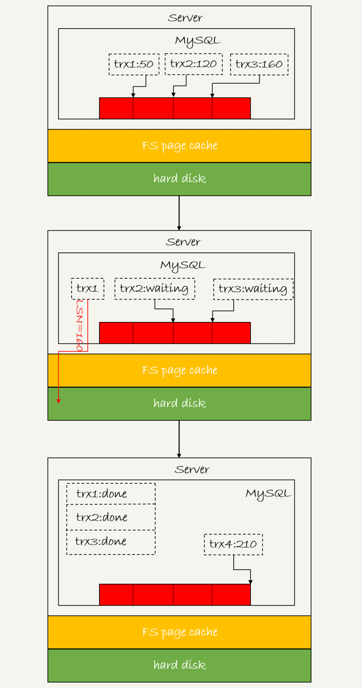
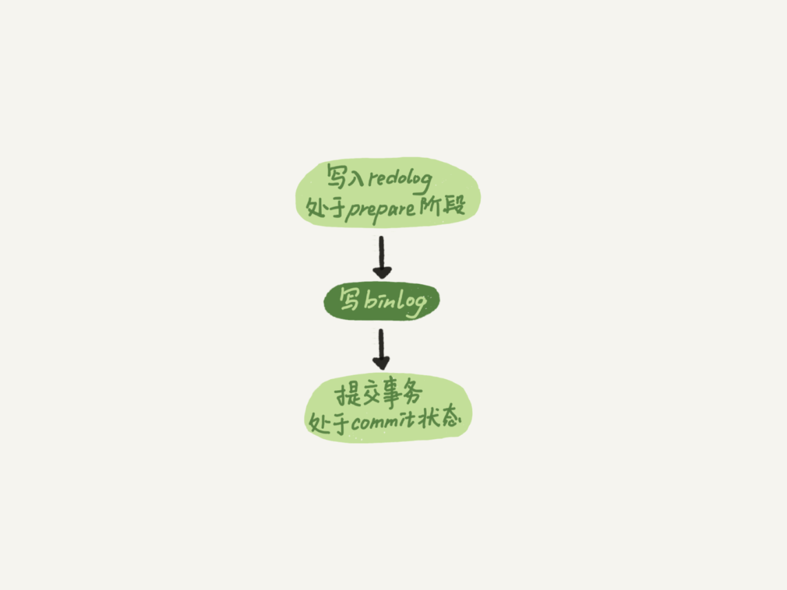

## 日志系统
redo log（重做日志）和 binlog（归档日志），类似酒馆的记账粉板和账本

WAL 技术，WAL 的全称是 Write-Ahead Logging，它的关键点就是先写日志，再写磁盘，也就是先写粉板，等不忙的时候再写账本。

具体来说，当有一条记录需要更新的时候，InnoDB 引擎就会先把记录写到 redo log（粉板）里面，并更新内存，这个时候更新就算完成了。同时，InnoDB 引擎会在适当的时候，将这个操作记录更新到磁盘里面，而这个更新往往是在系统比较空闲的时候做，这就像打烊以后掌柜做的事。


### redo Log
重做日志
 InnoDB 引擎特有的日志
 
 redo log 是固定大小的
 
比如可以配置为一组 4 个文件，每个文件的大小是 1GB，那么这块“粉板”总共就可以记录 4GB 的操作。
从头开始写，写到末尾就又回到开头循环写

write pos 是当前记录的位置，一边写一边后移，写到第 3 号文件末尾后就回到 0 号文件开头。checkpoint 是当前要擦除的位置，也是往后推移并且循环的，擦除记录前要把记录更新到数据文件。
write pos 和 checkpoint 之间的是“粉板”上还空着的部分，可以用来记录新的操作。如果 write pos 追上 checkpoint，表示“粉板”满了，这时候不能再执行新的更新，得停下来先擦掉一些记录，把 checkpoint 推进一下。
有了 redo log，InnoDB 就可以保证即使数据库发生异常重启，之前提交的记录都不会丢失，这个能力称为 crash-safe。


Redo log不是记录数据页“更新之后的状态”，而是记录这个页 “做了什么改动”。
注意，undo log 里记录的其实是“把 2 改成 1”，“把 3 改成 2”这样的操作逻辑

### binlog
Server 层也有自己的日志，称为 binlog（归档日志）。

Binlog有两种模式，statement 格式的话是记sql语句， row格式会记录行的内容，记两条，更新前和更新后都有。

### redo log 和 binlog 对比
- redo log 是物理日志，记录的是“在某个数据页上做了什么修改”；binlog 是逻辑日志，记录的是这个语句的原始逻辑，比如“给 ID=2 这一行的 c 字段加 1 ”。
- redo log 是循环写的，空间固定会用完；binlog 是可以追加写入的。“追加写”是指 binlog 文件写到一定大小后会切换到下一个，并不会覆盖以前的日志。

redo log 用于保证 crash-safe 能力。innodb_flush_log_at_trx_commit 这个参数设置成 1 的时候，表示每次事务的 redo log 都直接持久化到磁盘。这个参数我建议你设置成 1，这样可以保证 MySQL 异常重启之后数据不丢失。
sync_binlog 这个参数设置成 1 的时候，表示每次事务的 binlog 都持久化到磁盘。这个参数我也建议你设置成 1，这样可以保证 MySQL 异常重启之后 binlog 不丢失。

### 两阶段提交
redo log 的写入拆成了两个步骤：prepare 和 commit，这就是"两阶段提交"。
两阶段提交
为什么必须有“两阶段提交”呢？这是为了让两份日志之间的逻辑一致。
保证数据库的一致性，必须要保证2份日志一致，使用的2阶段式提交；其实感觉像事务，不是成功就是失败，不能让中间环节出现，也就是一个成功，一个失败

1 prepare阶段 2 写binlog 3 commit
当在2之前崩溃时
重启恢复：后发现没有commit，回滚。备份恢复：没有binlog 。
一致
当在3之前崩溃
重启恢复：虽没有commit，但满足prepare和binlog完整，所以重启后会自动commit。备份：有binlog. 一致


用反证法来进行解释。
由于 redo log 和 binlog 是两个独立的逻辑，如果不用两阶段提交，要么就是先写完 redo log 再写 binlog，或者采用反过来的顺序。我们看看这两种方式会有什么问题。
先写 redo log 后写 binlog。假设在 redo log 写完，binlog 还没有写完的时候，MySQL 进程异常重启。由于我们前面说过的，redo log 写完之后，系统即使崩溃，仍然能够把数据恢复回来，所以恢复后这一行 c 的值是 1。
但是由于 binlog 没写完就 crash 了，这时候 binlog 里面就没有记录这个语句。因此，之后备份日志的时候，存起来的 binlog 里面就没有这条语句。
然后你会发现，如果需要用这个 binlog 来恢复临时库的话，由于这个语句的 binlog 丢失，这个临时库就会少了这一次更新，恢复出来的这一行 c 的值就是 0，与原库的值不同。
先写 binlog 后写 redo log。如果在 binlog 写完之后 crash，由于 redo log 还没写，崩溃恢复以后这个事务无效，所以这一行 c 的值是 0。但是 binlog 里面已经记录了“把 c 从 0 改成 1”这个日志。所以，在之后用 binlog 来恢复的时候就多了一个事务出来，恢复出来的这一行 c 的值就是 1，与原库的值不同。
可以看到，如果不使用“两阶段提交”，那么数据库的状态就有可能和用它的日志恢复出来的库的状态不一致。

简单说，redo log 和 binlog 都可以用于表示事务的提交状态，而两阶段提交就是让这两个状态保持逻辑上的一致。

#### binlog 的写入机制
其实，binlog 的写入逻辑比较简单：

事务执行过程中，先把日志写到 binlog cache，事务提交的时候，再把 binlog cache 写到 binlog 文件中。
一个事务的 binlog 是不能被拆开的，因此不论这个事务多大，也要确保一次性写入。

这就涉及到了 binlog cache 的保存问题。
系统给 binlog cache 分配了一片内存，每个线程一个，参数 binlog_cache_size 用于控制单个线程内 binlog cache 所占内存的大小。如果超过了这个参数规定的大小，就要暂存到磁盘。
事务提交的时候，执行器把 binlog cache 里的完整事务写入到 binlog 中，并清空 binlog cache。

状态如图 1 所示。

图 1 binlog 写盘状态

可以看到，每个线程有自己 binlog cache，但是共用同一份 binlog 文件。

图中的 write，指的就是指把日志写入到文件系统的 page cache，并没有把数据持久化到磁盘，所以速度比较快。

图中的 fsync，才是将数据持久化到磁盘的操作。一般情况下，我们认为 fsync 才占磁盘的 IOPS。

write 和 fsync 的时机，是由参数 sync_binlog 控制的：
- sync_binlog=0 的时候，表示每次提交事务都只 write，不 fsync；
- sync_binlog=1 的时候，表示每次提交事务都会执行 fsync；
- sync_binlog=N(N>1) 的时候，表示每次提交事务都 write，但累积 N 个事务后才 fsync。

因此，在出现 IO 瓶颈的场景里，将 sync_binlog 设置成一个比较大的值，可以提升性能。在实际的业务场景中，考虑到丢失日志量的可控性，一般不建议将这个参数设成 0，比较常见的是将其设置为 100~1000 中的某个数值。
但是，将 sync_binlog 设置为 N，对应的风险是：如果主机发生异常重启，会丢失最近 N 个事务的 binlog 日志。

#### redo log 的写入机制
事务在执行过程中，生成的 redo log 是要先写到 redo log buffer 的。

Q: redo log buffer 里面的内容，是不是每次生成后都要直接持久化到磁盘呢？
A: 不需要。
如果事务执行期间 MySQL 发生异常重启，那这部分日志就丢了。由于事务并没有提交，所以这时日志丢了也不会有损失。

Q: 事务还没提交的时候，redo log buffer 中的部分日志有没有可能被持久化到磁盘呢？
A：确实会有。
这个问题，要从 redo log 可能存在的三种状态说起。这三种状态，对应的就是图 2 中的三个颜色块。


图 2 MySQL redo log 存储状态

这三种状态分别是：
- 存在 redo log buffer 中，物理上是在 MySQL 进程内存中，就是图中的红色部分；
- 写到磁盘 (write)，但是没有持久化（fsync)，物理上是在文件系统的 page cache 里面，也就是图中的黄色部分；
- 持久化到磁盘，对应的是 hard disk，也就是图中的绿色部分。

三种操作速度说明：
- 日志写到 redo log buffer 、wirte 到 page cache ： 很快
- 持久化到磁盘： 很慢

##### innodb_flush_log_at_trx_commit 参数
为了控制 redo log 的写入策略，它有三种可能取值：
设置为 0 的时候，表示每次事务提交时都只是把 redo log 留在 redo log buffer 中 ;
设置为 1 的时候，表示每次事务提交时都将 redo log 直接持久化到磁盘；
设置为 2 的时候，表示每次事务提交时都只是把 redo log 写到 page cache。

回到刚才那个问题：一个没有提交的事务的 redo log，是有可能持久化到磁盘的。主要有三种情况:
1、 后台线程每秒一次的轮询操作
> InnoDB 有一个后台线程，每隔 1 秒，就会把 redo log buffer 中的日志，调用 write 写到文件系统的 page cache，然后调用 fsync 持久化到磁盘。
注意，事务执行中间过程的 redo log 也是直接写在 redo log buffer 中的，这些 redo log 也会被后台线程一起持久化到磁盘。也就是说，一个没有提交的事务的 redo log，也是可能已经持久化到磁盘的。

2、redo log buffer 占用的空间即将达到 innodb_log_buffer_size 一半的时候，后台线程会主动写盘。
注意，由于这个事务并没有提交，所以这个写盘动作只是 write，而没有调用 fsync，也就是只留在了文件系统的 page cache。

3、并行的事务提交的时候，顺带将这个事务的 redo log buffer 持久化到磁盘。
假设一个事务 A 执行到一半，已经写了一些 redo log 到 buffer 中，这时候有另外一个线程的事务 B 提交，如果 innodb_flush_log_at_trx_commit 设置的是 1，那么按照这个参数的逻辑，事务 B 要把 redo log buffer 里的日志全部持久化到磁盘。这时候，就会带上事务 A 在 redo log buffer 里的日志一起持久化到磁盘。

这里需要说明的是，我们介绍两阶段提交的时候说过，时序上 redo log 先 prepare， 再写 binlog，最后再把 redo log commit。
如果把 innodb_flush_log_at_trx_commit 设置成 1，那么 redo log 在 prepare 阶段就要持久化一次，因为有一个崩溃恢复逻辑是要依赖于 prepare 的 redo log，再加上 binlog 来恢复的。
每秒一次后台轮询刷盘，再加上崩溃恢复这个逻辑，InnoDB 就认为 redo log 在 commit 的时候就不需要 fsync 了，只会 write 到文件系统的 page cache 中就够了。

通常我们说 MySQL 的“双 1”配置，指的就是 sync_binlog 和 innodb_flush_log_at_trx_commit 都设置成 1。也就是说，一个事务完整提交前，需要等待两次刷盘，一次是 redo log（prepare 阶段），一次是 binlog。
这时候，你可能有一个疑问，这意味着我从 MySQL 看到的 TPS 是每秒两万的话，每秒就会写四万次磁盘。但是，我用工具测试出来，磁盘能力也就两万左右，怎么能实现两万的 TPS？
解释这个问题，就要用到组提交（group commit）机制了。

这里，我需要先和你介绍日志逻辑序列号（log sequence number，LSN）的概念。LSN 是单调递增的，用来对应 redo log 的一个个写入点。每次写入长度为 length 的 redo log， LSN 的值就会加上 length。
LSN 也会写到 InnoDB 的数据页中，来确保数据页不会被多次执行重复的 redo log。

如图 3 所示，是三个并发事务 (trx1, trx2, trx3) 在 prepare 阶段，都写完 redo log buffer，持久化到磁盘的过程，对应的 LSN 分别是 50、120 和 160。

图 3 redo log 组提交
从图中可以看到，
trx1 是第一个到达的，会被选为这组的 leader；
等 trx1 要开始写盘的时候，这个组里面已经有了三个事务，这时候 LSN 也变成了 160；
trx1 去写盘的时候，带的就是 LSN=160，因此等 trx1 返回时，所有 LSN 小于等于 160 的 redo log，都已经被持久化到磁盘；
这时候 trx2 和 trx3 就可以直接返回了。
所以，一次组提交里面，组员越多，节约磁盘 IOPS 的效果越好。但如果只有单线程压测，那就只能老老实实地一个事务对应一次持久化操作了。
在并发更新场景下，第一个事务写完 redo log buffer 以后，接下来这个 fsync 越晚调用，组员可能越多，节约 IOPS 的效果就越好。
为了让一次 fsync 带的组员更多，MySQL 有一个很有趣的优化：拖时间。在介绍两阶段提交的时候，我曾经给你画了一个图，现在我把它截过来。

图 4 两阶段提交
图中，我把“写 binlog”当成一个动作。但实际上，写 binlog 是分成两步的：
先把 binlog 从 binlog cache 中写到磁盘上的 binlog 文件；
调用 fsync 持久化。

MySQL 为了让组提交的效果更好，把 redo log 做 fsync 的时间拖到了步骤 1 之后。也就是说，上面的图变成了这样：

图 5 两阶段提交细化

这么一来，binlog 也可以组提交了。在执行图 5 中第 4 步把 binlog fsync 到磁盘时，如果有多个事务的 binlog 已经写完了，也是一起持久化的，这样也可以减少 IOPS 的消耗。
不过通常情况下第 3 步执行得会很快，所以 binlog 的 write 和 fsync 间的间隔时间短，导致能集合到一起持久化的 binlog 比较少，因此 binlog 的组提交的效果通常不如 redo log 的效果那么好。

如果你想提升 binlog 组提交的效果，可以通过设置 binlog_group_commit_sync_delay 和 binlog_group_commit_sync_no_delay_count 来实现。
binlog_group_commit_sync_delay 参数，表示延迟多少微秒后才调用 fsync;
binlog_group_commit_sync_no_delay_count 参数，表示累积多少次以后才调用 fsync。
这两个条件是或的关系，也就是说只要有一个满足条件就会调用 fsync。

所以，当 binlog_group_commit_sync_delay 设置为 0 的时候，binlog_group_commit_sync_no_delay_count 也无效了。
之前有同学在评论区问到，WAL 机制是减少磁盘写，可是每次提交事务都要写 redo log 和 binlog，这磁盘读写次数也没变少呀？
现在你就能理解了，WAL 机制主要得益于两个方面：
- redo log 和 binlog 都是顺序写，磁盘的顺序写比随机写速度要快；
- 组提交机制，可以大幅度降低磁盘的 IOPS 消耗。

分析到这里，我们再来回答这个问题：如果你的 MySQL 现在出现了性能瓶颈，而且瓶颈在 IO 上，可以通过哪些方法来提升性能呢？
针对这个问题，可以考虑以下三种方法：
- 设置 binlog_group_commit_sync_delay 和 binlog_group_commit_sync_no_delay_count 参数，减少 binlog 的写盘次数。这个方法是基于“额外的故意等待”来实现的，因此可能会增加语句的响应时间，但没有丢失数据的风险。
- 将 sync_binlog 设置为大于 1 的值（比较常见是 100~1000）。这样做的风险是，主机掉电时会丢 binlog 日志。
- 将 innodb_flush_log_at_trx_commit 设置为 2。这样做的风险是，主机掉电的时候会丢数据。
    > 我不建议你把 innodb_flush_log_at_trx_commit 设置成 0。因为把这个参数设置成 0，表示 redo log 只保存在内存中，这样的话 MySQL 本身异常重启也会丢数据，风险太大。而 redo log 写到文件系统的 page cache 的速度也是很快的，所以将这个参数设置成 2 跟设置成 0 其实性能差不多，但这样做 MySQL 异常重启时就不会丢数据了，相比之下风险会更小。


### 怎样让数据库恢复到半个月内任意一秒的状态？
前面我们说过了，binlog 会记录所有的逻辑操作，并且是采用“追加写”的形式。如果你的 DBA 承诺说半个月内可以恢复，那么备份系统中一定会保存最近半个月的所有 binlog，同时系统会定期做整库备份。这里的“定期”取决于系统的重要性，可以是一天一备，也可以是一周一备。
当需要恢复到指定的某一秒时，比如某天下午两点发现中午十二点有一次误删表，需要找回数据，那你可以这么做：
首先，找到最近的一次全量备份，如果你运气好，可能就是昨天晚上的一个备份，从这个备份恢复到临时库；
然后，从备份的时间点开始，将备份的 binlog 依次取出来，重放到中午误删表之前的那个时刻。
这样你的临时库就跟误删之前的线上库一样了，然后你可以把表数据从临时库取出来，按需要恢复到线上库去。


### binlog很多余，只要redo log就够了?
binlog 暂时还不能去掉

一个原因是，redolog只有InnoDB有，别的引擎没有。

另一个原因是，redolog是循环写的，不持久保存，binlog的“归档”这个功能，redolog是不具备的。


### 一天一备跟一周一备的对比
好处是“最长恢复时间”更短。
在一天一备的模式里，最坏情况下需要应用一天的 binlog。比如，你每天 0 点做一次全量备份，而要恢复出一个到昨天晚上 23 点的备份。
一周一备最坏情况就要应用一周的 binlog 了。


#### 在两阶段提交的不同时刻，MySQL 异常重启会出现什么现象。
如果在图中时刻 A 的地方，也就是写入 redo log 处于 prepare 阶段之后、写 binlog 之前，发生了崩溃（crash），由于此时 binlog 还没写，redo log 也还没提交，所以崩溃恢复的时候，这个事务会回滚。这时候，binlog 还没写，所以也不会传到备库。到这里，大家都可以理解。
大家出现问题的地方，主要集中在时刻 B，也就是 binlog 写完，redo log 还没 commit 前发生 crash，那崩溃恢复的时候 MySQL 会怎么处理？
我们先来看一下崩溃恢复时的判断规则。
如果 redo log 里面的事务是完整的，也就是已经有了 commit 标识，则直接提交；
如果 redo log 里面的事务只有完整的 prepare，则判断对应的事务 binlog 是否存在并完整：
a. 如果是，则提交事务；
b. 否则，回滚事务。

#### 追问 1：MySQL 怎么知道 binlog 是完整的?
回答：一个事务的 binlog 是有完整格式的：
statement 格式的 binlog，最后会有 COMMIT；
row 格式的 binlog，最后会有一个 XID event。
另外，在 MySQL 5.6.2 版本以后，还引入了 binlog-checksum 参数，用来验证 binlog 内容的正确性。对于 binlog 日志由于磁盘原因，可能会在日志中间出错的情况，MySQL 可以通过校验 checksum 的结果来发现。所以，MySQL 还是有办法验证事务 binlog 的完整性的。
#### 追问 2：redo log 和 binlog 是怎么关联起来的?
回答：它们有一个共同的数据字段，叫 XID。崩溃恢复的时候，会按顺序扫描 redo log：
如果碰到既有 prepare、又有 commit 的 redo log，就直接提交；
如果碰到只有 parepare、而没有 commit 的 redo log，就拿着 XID 去 binlog 找对应的事务。
#### 追问 3：处于 prepare 阶段的 redo log 加上完整 binlog，重启就能恢复，MySQL 为什么要这么设计?
回答：其实，这个问题还是跟我们在反证法中说到的数据与备份的一致性有关。在时刻 B，也就是 binlog 写完以后 MySQL 发生崩溃，这时候 binlog 已经写入了，之后就会被从库（或者用这个 binlog 恢复出来的库）使用。
所以，在主库上也要提交这个事务。采用这个策略，主库和备库的数据就保证了一致性。
#### 追问 4：如果这样的话，为什么还要两阶段提交呢？干脆先 redo log 写完，再写 binlog。崩溃恢复的时候，必须得两个日志都完整才可以。是不是一样的逻辑？
回答：其实，两阶段提交是经典的分布式系统问题，并不是 MySQL 独有的。
如果必须要举一个场景，来说明这么做的必要性的话，那就是事务的持久性问题。
对于 InnoDB 引擎来说，如果 redo log 提交完成了，事务就不能回滚（如果这还允许回滚，就可能覆盖掉别的事务的更新）。而如果 redo log 直接提交，然后 binlog 写入的时候失败，InnoDB 又回滚不了，数据和 binlog 日志又不一致了。
两阶段提交就是为了给所有人一个机会，当每个人都说“我 ok”的时候，再一起提交。
#### 追问 5：不引入两个日志，也就没有两阶段提交的必要了。只用 binlog 来支持崩溃恢复，又能支持归档，不就可以了？
回答：这位同学的意思是，只保留 binlog，然后可以把提交流程改成这样：… -> “数据更新到内存” -> “写 binlog” -> “提交事务”，是不是也可以提供崩溃恢复的能力？
答案是不可以。
如果说历史原因的话，那就是 InnoDB 并不是 MySQL 的原生存储引擎。MySQL 的原生引擎是 MyISAM，设计之初就有没有支持崩溃恢复。
InnoDB 在作为 MySQL 的插件加入 MySQL 引擎家族之前，就已经是一个提供了崩溃恢复和事务支持的引擎了。
InnoDB 接入了 MySQL 后，发现既然 binlog 没有崩溃恢复的能力，那就用 InnoDB 原有的 redo log 好了。
而如果说实现上的原因的话，就有很多了。就按照问题中说的，只用 binlog 来实现崩溃恢复的流程，我画了一张示意图，这里就没有 redo log 了。

图 2 只用 binlog 支持崩溃恢复
这样的流程下，binlog 还是不能支持崩溃恢复的。我说一个不支持的点吧：binlog 没有能力恢复“数据页”。
如果在图中标的位置，也就是 binlog2 写完了，但是整个事务还没有 commit 的时候，MySQL 发生了 crash。
重启后，引擎内部事务 2 会回滚，然后应用 binlog2 可以补回来；但是对于事务 1 来说，系统已经认为提交完成了，不会再应用一次 binlog1。
但是，InnoDB 引擎使用的是 WAL 技术，执行事务的时候，写完内存和日志，事务就算完成了。如果之后崩溃，要依赖于日志来恢复数据页。
也就是说在图中这个位置发生崩溃的话，事务 1 也是可能丢失了的，而且是数据页级的丢失。此时，binlog 里面并没有记录数据页的更新细节，是补不回来的。
你如果要说，那我优化一下 binlog 的内容，让它来记录数据页的更改可以吗？但，这其实就是又做了一个 redo log 出来。
所以，至少现在的 binlog 能力，还不能支持崩溃恢复。
追问 6：那能不能反过来，只用 redo log，不要 binlog？
回答：如果只从崩溃恢复的角度来讲是可以的。你可以把 binlog 关掉，这样就没有两阶段提交了，但系统依然是 crash-safe 的。
但是，如果你了解一下业界各个公司的使用场景的话，就会发现在正式的生产库上，binlog 都是开着的。因为 binlog 有着 redo log 无法替代的功能。
一个是归档。redo log 是循环写，写到末尾是要回到开头继续写的。这样历史日志没法保留，redo log 也就起不到归档的作用。
一个就是 MySQL 系统依赖于 binlog。binlog 作为 MySQL 一开始就有的功能，被用在了很多地方。其中，MySQL 系统高可用的基础，就是 binlog 复制。
还有很多公司有异构系统（比如一些数据分析系统），这些系统就靠消费 MySQL 的 binlog 来更新自己的数据。关掉 binlog 的话，这些下游系统就没法输入了。
总之，由于现在包括 MySQL 高可用在内的很多系统机制都依赖于 binlog，所以“鸠占鹊巢”redo log 还做不到。你看，发展生态是多么重要。
#### 追问 7：redo log 一般设置多大？
回答：redo log 太小的话，会导致很快就被写满，然后不得不强行刷 redo log，这样 WAL 机制的能力就发挥不出来了。
所以，如果是现在常见的几个 TB 的磁盘的话，就不要太小气了，直接将 redo log 设置为 4 个文件、每个文件 1GB 吧。
#### 追问 8：正常运行中的实例，数据写入后的最终落盘，是从 redo log 更新过来的还是从 buffer pool 更新过来的呢？
回答：这个问题其实问得非常好。这里涉及到了，“redo log 里面到底是什么”的问题。
实际上，redo log 并没有记录数据页的完整数据，所以它并没有能力自己去更新磁盘数据页，也就不存在“数据最终落盘，是由 redo log 更新过去”的情况。
如果是正常运行的实例的话，数据页被修改以后，跟磁盘的数据页不一致，称为脏页。最终数据落盘，就是把内存中的数据页写盘。这个过程，甚至与 redo log 毫无关系。
在崩溃恢复场景中，InnoDB 如果判断到一个数据页可能在崩溃恢复的时候丢失了更新，就会将它读到内存，然后让 redo log 更新内存内容。更新完成后，内存页变成脏页，就回到了第一种情况的状态。
#### 追问 9：redo log buffer 是什么？是先修改内存，还是先写 redo log 文件？
回答：这两个问题可以一起回答。
在一个事务的更新过程中，日志是要写多次的。比如下面这个事务：
```sql
begin;
insert into t1 ...
insert into t2 ...
commit;
```
这个事务要往两个表中插入记录，插入数据的过程中，生成的日志都得先保存起来，但又不能在还没 commit 的时候就直接写到 redo log 文件里。
所以，redo log buffer 就是一块内存，用来先存 redo 日志的。也就是说，在执行第一个 insert 的时候，数据的内存被修改了，redo log buffer 也写入了日志。
但是，真正把日志写到 redo log 文件（文件名是 ib_logfile+ 数字），是在执行 commit 语句的时候做的。
（这里说的是事务执行过程中不会“主动去刷盘”，以减少不必要的 IO 消耗。但是可能会出现“被动写入磁盘”，比如内存不够、其他事务提交等情况。这个问题我们会在后面第 22 篇文章《MySQL 有哪些“饮鸩止渴”的提高性能的方法？》中再详细展开）。
单独执行一个更新语句的时候，InnoDB 会自己启动一个事务，在语句执行完成的时候提交。过程跟上面是一样的，只不过是“压缩”到了一个语句里面完成。


#### 问题 2：为什么 binlog cache 是每个线程自己维护的，而 redo log buffer 是全局共用的？
回答：MySQL 这么设计的主要原因是，binlog 是不能“被打断的”。
一个事务的 binlog 必须连续写，因此要整个事务完成后，再一起写到文件里。
 而 redo log 并没有这个要求，中间有生成的日志可以写到 redo log buffer 中。redo log buffer 中的内容还能“搭便车”，其他事务提交的时候可以被一起写到磁盘中。